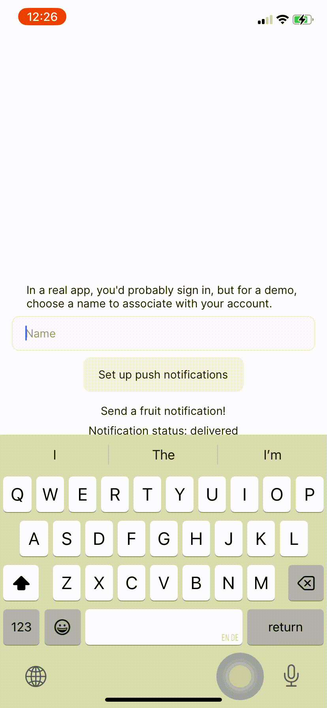

# Convex Push Notifications Component

[](https://badge.fury.io/js/@convex-dev%2Fexpo-push-notifications)

This is a Convex component that integrates with [Expo's push notification API](https://docs.expo.dev/push-notifications/overview/)
to allow sending mobile push notifications to users of your app. It will batch calls to Expo's API and handle retrying delivery.

<details>
  <summary>Demo GIF</summary>



</details>

<details>
<summary>Example usage:</summary>

```tsx
// App.tsx
<Button
  onPress={() => {
    void convex.mutation(api.example.sendPushNotification, {
      to: otherUser,
      title: `Hi from ${currentUser.name}`,
    });
  }}
>
  <Text>Say hi!</Text>
</Button>
```

```typescript
// convex/example.ts
export const sendPushNotification = mutation({
  args: { title: v.string(), to: v.id("users") },
  handler: async (ctx, args) => {
    // Sending a notification
    return pushNotifications.sendPushNotification(ctx, {
      userId: args.to,
      notification: {
        title: args.title,
      },
    });
  },
});
```

</details>

### Convex App

You'll need a Convex App running on Expo to use the component. Follow the [Convex quickstart for Expo](https://docs.convex.dev/quickstart/react-native) to create one.

## Installation

Install the component package:

```
npm i @convex-dev/expo-push-notifications
```

Create a `convex.config.ts` file in your app's `convex/` folder and install the component by calling `use`:

```ts
// convex/convex.config.ts
import { defineApp } from "convex/server";
import pushNotifications from "@convex-dev/expo-push-notifications/component/convex.config.js";

const app = defineApp();
app.use(pushNotifications);
// other components

export default app;
```

Instantiate the `PushNotifications` client in your Convex functions:

```ts
// convex/example.ts
import { PushNotifications } from "@convex-dev/expo-push-notifications";

const pushNotifications = new PushNotifications(components.pushNotifications, {
  logLevel: "DEBUG",
});
```

It takes in an optional type parameter (defaulting to `Id<"users">`) for the type to use as a unique identifier for push notification recipients:

```ts
import { PushNotifications } from "@convex-dev/expo-push-notifications";

export type Email = string & { __isEmail: true };

const pushNotifications = new PushNotifications<Email>(
  components.pushNotifications
);
```

Get a user's push notification token following the Expo documentation [here](https://docs.expo.dev/push-notifications/push-notifications-setup/#registering-for-push-notifications), and record it using a Convex mutation:

```ts
// convex/example.ts
export const recordPushNotificationToken = mutation({
  args: { token: v.string() },
  handler: async (ctx, args) => {
    const userId = await getAuthUserId(ctx);
    await pushNotifications.recordToken(ctx, {
      userId,
      pushToken: args.token,
    });
  },
});
```

Send notifications:

```ts
// convex/example.ts
export const sendPushNotification = mutation({
  args: { title: v.string(), to: v.string() },
  handler: async (ctx, args) => {
    await pushNotifications.sendPushNotification(ctx, {
      userId: args.to,
      notification: {
        title: args.title,
      },
    });
  },
});
```

You can pause and resume push notification sending for a user using the `pausePushNotifications` and `resumePushNotifications` methods.

## Troubleshooting

To add more logging, provide `PushNotifications` with a `logLevel` in the constructor:

```ts
const pushNotifications = new PushNotifications(components.pushNotifications, {
  logLevel: "DEBUG",
});
```

The push notification sender can be shutdown gracefully, and then restarted using the `shutdown` and `restart` methods.
